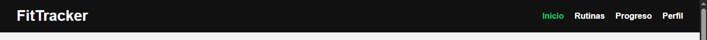
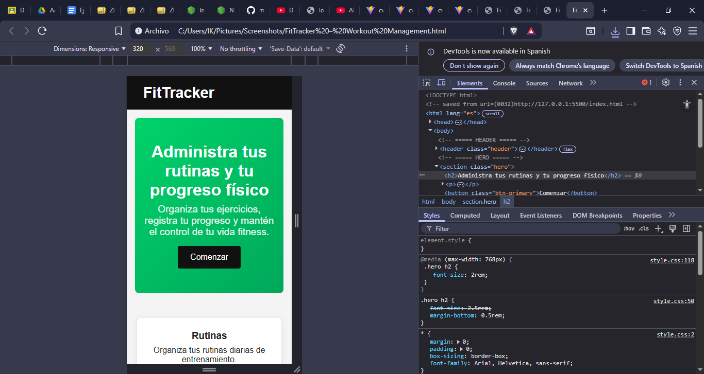

README – EV09

FitTracker UI (Maquetación Web con HTML y CSS)

FitTracker – Workout Management

Proyecto desarrollado como parte de la evidencia GA1-220501096-03-AA1-EV09, cuyo objetivo es diseñar la interfaz gráfica del sistema FitTracker utilizando HTML5 y CSS3, siguiendo principios de maquetación, usabilidad y diseño responsivo.

Objetivo del ejercicio

Construir una interfaz web basada en un prototipo visual, aplicando:

Estructura semántica en HTML5

Estilos CSS organizados por componentes

Flexbox para distribución

Diseño responsive

Buenas prácticas de maquetación

Estructura del Proyecto
fittracker-ui/
├── index.html
├── styles/
│ └── style.css
├── assets/
│ ├── images/
│ ├── icons/
│ ├── fonts/
│ └── videos/
└── templates/

Características del diseño implementado

Header con navegación
Sección Hero con diseño en gradiente
Botón principal estilizado
Cards informativas organizadas con Flexbox
Footer semántico
Responsive para dispositivos móviles
Proyecto limpio, ordenado y modular

Capturas

A continuación se incluyen capturas del proyecto funcionando:

# Header

# Sección Hero

# Cards

# Footer

# Vista Responsive

